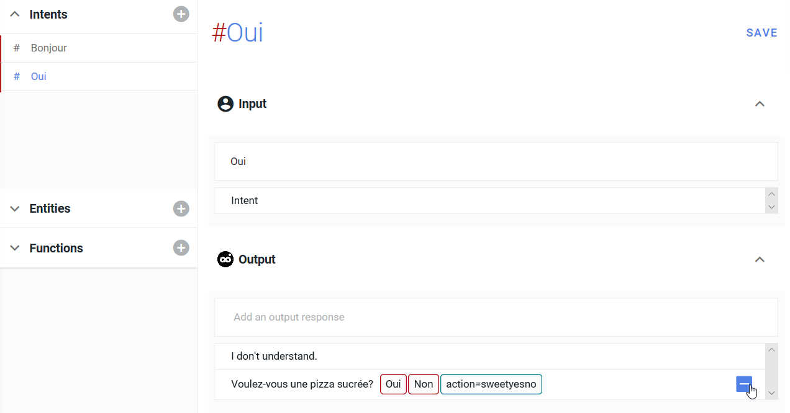
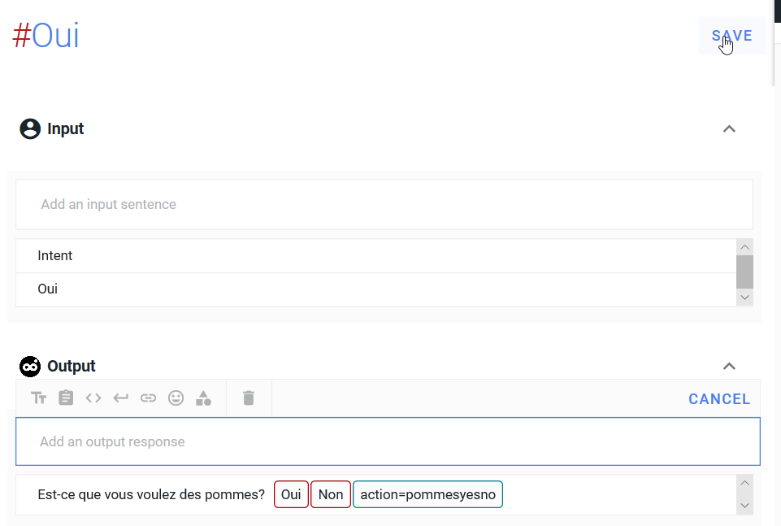

L'écran de départ ressemble à ceci :

Il faut ajouter un intent en cliquant sur le plus 

Il faut supprimer l'input "Intent" et  l'output "I don't understand" en cliquant sur le moins sur la ligne puis sur Delete.

Il faut renommer l'output en "Bonjour"

On inscrit dans l'intent les lignes suivantes :

    #Bonjour 
    Input: bonjour
    bjr
    output: Voulez-vous une pizza sucrée? [Oui] [Non] <action=sweetyesno>

 

ce qui donne à l'écran :

Il faut cliquer sur le signe plus de la ligne et cliquer sur SAVE pour sauvegarder la progression du paramétrage.

Il faut ensuite cliquer sur "SAVE" en haut dans le cadre des intents

Le texte action = sweetyesno doit être recopié dans la conditionnelle suivante pour lier l'intent #Bonjour à l'intent #Oui suivant. On va suivre la branche des Oui pour enter les deux Outputs contenus dans l'intent #Oui sur la branche de gauche du schéma.

Pour ajouter l'intent Oui, cliquer sur le signe plus gris/bleu à droite dans la colonne intents.

Pour modifier le nom de l'intent, il faut cliquer sur le crayon à droite dans la ligne qui vient d'apparaître,

Puis saisir le nouveau nom,

Ensuite il faut entrer Oui dans la ligne d'inputs et supprimer les outputs éventuellement déjà présents en cliquant sur le moins sur leur ligne.

Ensuite on va entrer le texte des outputs de l'intent Oui : 

    #Oui
    Input : Oui
    Output : 
    action=sweetyesno
    Est-ce que vous voulez des pommes?
    [Oui][Non]<action = pommesyesno>

On entre le code action=sweetyesno en cliquant sur la conditionnelle

Ne pas oublier de cliquer sur le signe plus et sur SAVE à la fin de chaque modification d'intent

Et pour le deuxième output, qui constitue la fin de la chaîne des "Oui"

    action=pommesyesno
    C'est parti pour une pizza pommes chocolat 

Après avoir cliqué sur SAVE, vous pouvez faire des tests dans le playground ainsi qu'indiqué sur les captures d'écrans, pour voir si vos enchaînements se passent bien.

Félicitations, vous avez écrit votre première branche de schéma conversationnel! Maintenant nous allons rajouter le Non qui conduit à Pizza tout chocolat.

<a href="En-francais4.html" class="previous">&laquo; Previous</a>
<a href="En-francais6.html" class="next">Next &raquo;</a>

