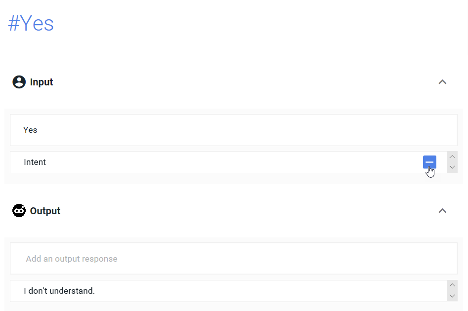

The start screen looks like this :

One must add an intent clicking on the plus sign :

one must delete the Input "Intent" and the Output "I don't understand" clicking on the minus on the line and on delete.

Click on the pencil to the right of the intents column to rename the intent

In the intent one must write the following

    #Hello
    Input: Hello
    output: Would you like a sweet pizza? [yes] [no] <action=sweetyesno>

 

which on screen shows :

One must click on the plus end of line and on SAVE top of page to save the changes.

To add the Yes intent (#Yes), click on the grey/blue plus sign on the right in intents column

To modify the name of the intent, one must click the pencil on the right of the upcoming line,

Then type in the new name

Then enter Yes in the line of inputs and delete the default outputs present clicking on the minus of the line and SAVE on top of page.

Ensuite il faut entrer Oui dans la ligne d'inputs et supprimer les autres inputs et outputs éventuellement déjà présents en cliquant sur le moins sur leur ligne.

Then we will enter the text of the Yes intent's output : 

    #Yes
    Input : Yes
    Output : 
    action=sweetyesno
    Would you like apples on it?
    [Yes][No]<action = applesyesno>

action=sweetyesno must be entered clicking on the three pointed star called conditionnal or insert condition

Never forget to click on the plus sign end of line and on SAVE on top each time an intent is modified.

Add the second output, ending the all-yes side of the diagram.

    action=applesyesno
    There goes an apple-chocolate pizza!

After having clicked SAVE, we can test out the conversation in the playground to see if the dialogue unfolds correctly.

The conversation should look something like this : 

Congratulations, you have written your first branch of conversation! Now we will add the intent No to complete the diagram.

<a href="English-versions4.html" class="previous">&laquo; Previous</a>
<a href="English-version6.html" class="next">Next &raquo;</a>

