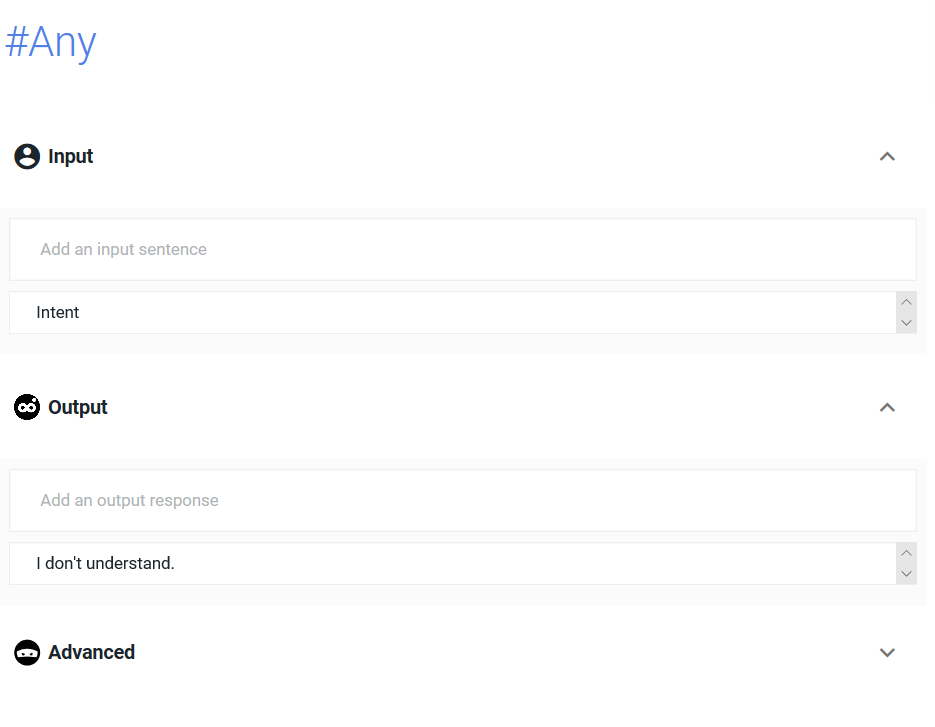
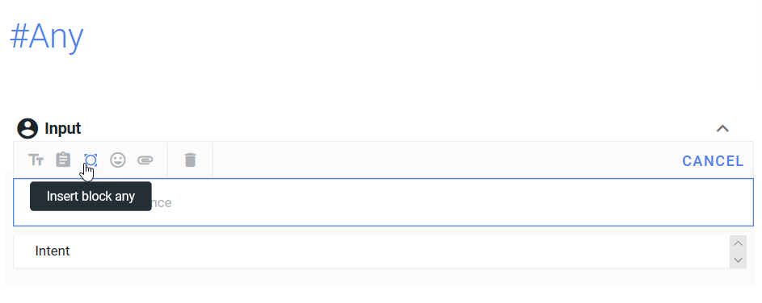
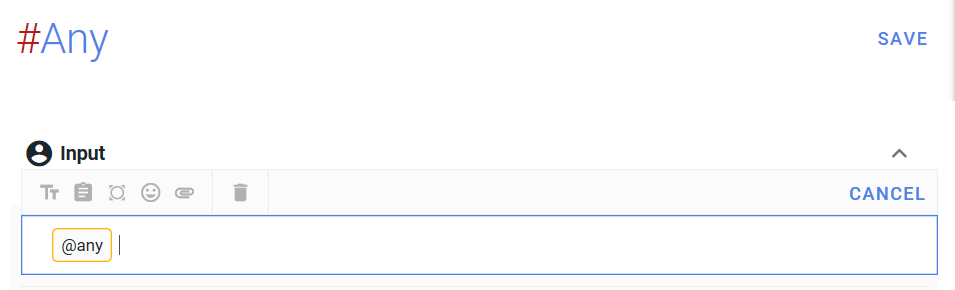
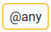
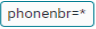
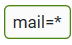

One can quite, and this is the case here, create two conversation patterns in the same bot. "Contact" will be created alongside with "Pizza".

Note: An intent often has one or two inputs for several different outputs.

    #Contact
    Input : contact
    Output : 
    Would you like to give out your phone number ?
    <action = getphoneyesno>[Yes][No]

Click on plus sign and SAVE;

  

 On va insérer une variable. Il faut écrire la valeur de la variable à l'intérieur du carré qui résulte de la pression sur le bouton insert variable assignment. 

 #Oui 
Input : Oui 
Output : 
action = getphoneyesno  
What is your phone number?  
<action=confirmphonenbr>

click on plus sign and SAVE.

## 1. #Any intents 

create an intent #Any:

Click on new intent, rename in #Any, and delete default outputs and inputs clicking on the end of line minus sign. ("intent" for input and "I don't understand" for output)

Then click on insert block any in #Any inputs :

the #Any intent is meant to stock any user inputted value in a variable  ,insert variable assignment.

then the output :

#Any 
input :  
Output: 
action = confirmphonenbr 
 is your phone number, right? 
<action=phonenbrconfirmed>[Yes][No] 

Click SAVE after modifying the intent,

#Yes 
action=phonenbrconfirmed 
What is your mail? <action=confirmmail> 

#Any 
action=confirmmail 
 is your mail, right? 
<action=mailconfirmed>[Yes][No] 

#Yes 
action=mailconfirmed 
Ok, your contact is saved. 

Now we'll deal with the no going directly to e-mail

#No 
Input : No 
Output:
action = getphoneyesno 
What is your e-mail? <action=confirmmail2> 

We need to rewrite that step in order to ask for the e-mail. We add index 2 to make a difference with the first branch. 

#Any 
Output: 
action=confirmmail? 
 is your mail, right? 
<action=mailconfirmed2>[Yes][No] 

#Yes 
action=mailconfirmed2 
Ok, your mail is saved. 

## 2. Loops on "No"

We will add the two "No" loops : the arrow takes them up one step ; we will take as a conditional the previous line of code, which will loop the chatbot on the question.

( 
    #Yes 
    input=yes 
    output= ... <action=confirmphonenbr>  

#Any 
 action=confirmphonenbr 
 is your phone number, right? 
&lt;action = phonenbrconfirmed&gt; [Yes][No]  
 ) - rewritten as a reminder

 We will write the "No" inverting the actions called phonenbrconfirmed and confirmphonenbr, we will write phonenbrconfirmed in the conditional and confirmphonenbr in the code.

#Non 
action = phonenbrconfirmed  
What is your phone number? 
 <action=confirmphonenbr> 

likewise, on mail we will write a "No" between mailconfirmed et confirmmail

( 
    #Any 
action = confirmmail 
 is your e-mail adress, right?
&lt;action=mailconfirmed&gt;[Oui][Non] 

) rewritten as a reminder  

#No 
action= mailconfirmed 
What is your e-mail adress?
  <!--(mail=*)-->&lt;action=confirmmail&gt;

We are now done setting up diagram number 2!

<a href="English-version7.html" class="previous">&laquo; Previous</a>
<a href="English-version9.html" class="next">Next &raquo;</a>

