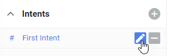
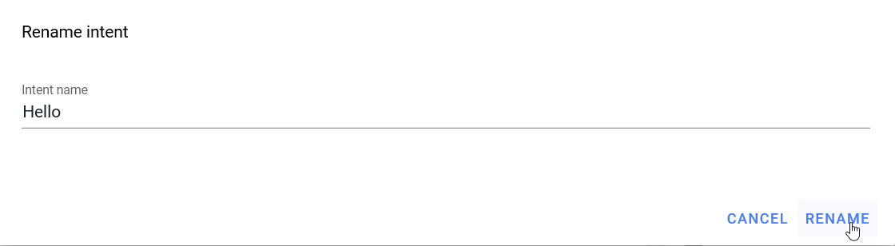
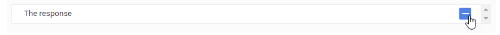
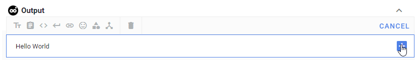

{{site.images_path}}

Nous allons d'abord créer un bot qui retourne un "Hello World"

Cliquer sur Create

et écrire "Hello", puis appuyer sur entrée, dans le playground pour vérifier que le bot retourne bien la phrase par défaut "the response".

 Cliquer sur le stylo pour renommer "First Intent" dans la colonne de gauche en "Hello"

Effacer "The response" en cliquant sur le signe moins en fin de ligne de l'output, et écrire "Hello world" en texte de remplacement. Cliquer sur SAVE sur le panneau Intents.

Ecrire "Hello" dans le playground et appuyer sur Entrée.

Et voilà, nous avons créé notre premier bot, qui retourne un simple "Hello World"! C'est un bot simpliste, qui va nous permettre de mieux comprendre comment paramétrer deux autres schémas de conversation, qui sont les schémas "Pizza", qui va montrer comment se gèrent des entrées oui/non et "Contact", qui va nous permettre de gérer des entrées plus complexes telles que la saisie d'une adresse e-mail ou d'un numéro de téléphone.
