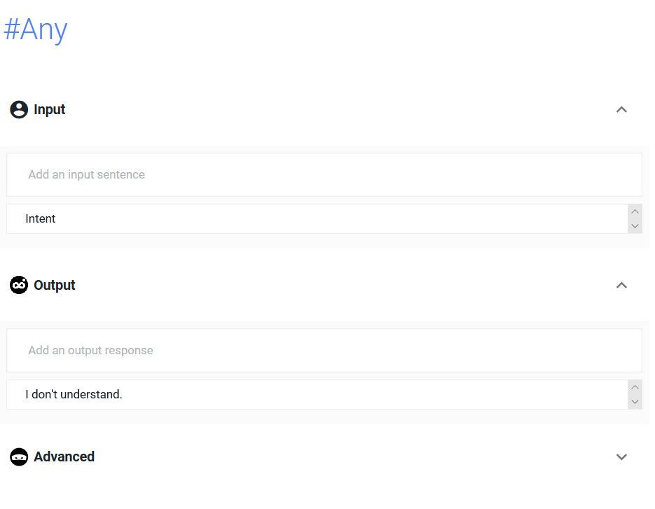
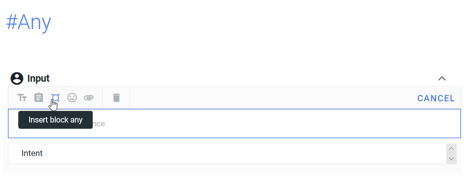

On peut tout à fait, et c'est le cas ici, créer deux schémas de conversation dans le même bot. On va créer la conversation "Contact" parallèlement à la conversation "Pizza".

À noter : Un intent compte souvent un ou deux inputs pour plusieurs outputs différents.

    #Contact
    Input : contact
    Output : 
    Voulez-vous donner votre numéro de téléphone ?
    <action = getphoneyesno>[Oui][Non]

Cliquer sur le signe plus et sur SAVE;

  

 On va insérer une variable. Il faut écrire la valeur de la variable à l'intérieur du carré qui résulte de la pression sur le bouton insert variable assignment. 

 #Oui 
Input : Oui 
Output : 
action = getphoneyesno  
Quel est votre numéro de téléphone?  
<action=confirmphonenbr>

Cliquer sur le signe plus et sur SAVE.

## 1. Les intents #Any

On va créer un intent #Any:

on clique sur créer un nouvel intent, on renomme l'intent en #Any, et on supprime les inputs et outputs déjà présents en cliquant sur le signe moins en bout de ligne pour input (marqué "intent") et output ("I don't understand")

Puis on clique sur insert block any dans les inputs de #Any :

l'intent #Any sert à stocker une valeur quelconque donnée par l'utilisateur dans une variable accessible avec le bouton  ,insert variable assignment.

Ensuite on paramètre l'output :

#Any 
input :  
Output: 
action = confirmphonenbr 
 est bien votre numéro de téléphone? 
<action=phonenbrconfirmed>[oui][non] 

On clique sur SAVE après avoir modifié l'intent,

#Oui 
action=phonenbrconfirmed 
Quel est votre mail? <action=confirmmail> 

#Any 
action=confirmmail 
 est bien votre mail? 
<action=mailconfirmed>[Oui][Non] ]

#Oui 
action=mailconfirmed 
Ok, votre contact est enregistré  

On a parcouru la branche des "Oui" du schéma. On va s'intéresser à la première branche "Non", qui permet de sauter l'étape du téléphone pour donner l'e-mail.

#Non 
Input : Non 
Output:
action = getphoneyesno 
Quel est votre mail? <action=confirmmail2> 

On est obligé de réécrire l'étape pour reprendre le mail. On ajoute un indice, 2, pour faire la différence avec la première branche.

#Any 
Output: 
action=confirmmail? 
 est bien votre mail? 
<action=mailconfirmed2>[Oui][Non] 

#Oui 
action=mailconfirmed2 
Ok, votre contact est enregistré. 

## 2. Les boucles sur Non

On va enfin ajouter les deux boucles "Non" : on remarque que la flèche les fait remonter d'une étape : on va donc prendre comme conditionnelle la ligne de code précédente, ce qui va faire reboucler le chatbot sur la question.

( 
    #Oui 
    input=oui 
    output= ... <action=confirmphonenbr>  

#Any 
 action=confirmphonenbr 
 est bien votre numéro de téléphone? 
&lt;action = phonenbrconfirmed&gt; [Oui][Non]  
 ) - réécrit pour rappel

 On va écrire le "Non" en reprenant et inversant les actions phonenbrconfirmed et confirmphonenbr, on va mettre phonenbrconfirmed dans la conditionnelle et confirmphonenbr dans le code.

#Non 
action = phonenbrconfirmed  
Quel est votre numéro de téléphone? 
 <action=confirmphonenbr> 

De même, sur mail on va écrire un "Non" entre mailconfirmed et confirmmail

( 
    #Any 
action = confirmmail 
 est bien votre mail?
&lt;action=mailconfirmed&gt;[Oui][Non] 

) 

#Non 
action= mailconfirmed 
Quel est votre mail? 
  <!--(mail=*)--> &lt;action=confirmmail&gt;

Nous avons dorénavant fini de paramétrer le schéma 2!

<a href="En-francais7.html" class="previous">&laquo; Previous</a>
<a href="En-francais9.html" class="next">Next &raquo;</a>

